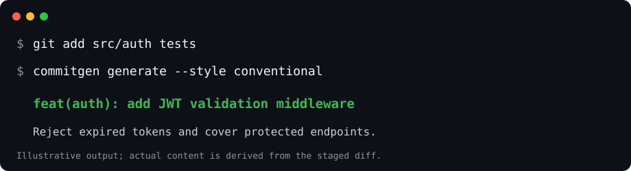
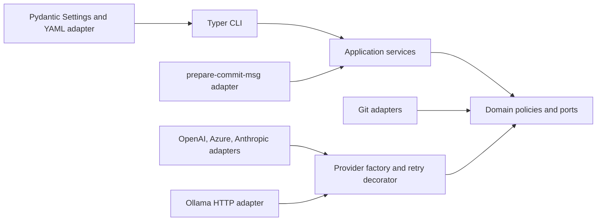

# AI Commit Generator

[](https://github.com/privlin-lgtm/ai_commit_generator/actions/workflows/ci.yml)


Generate useful commit messages from staged Git changes without coupling your
workflow to one model vendor. `commitgen` combines bounded Git analysis,
deterministic Conventional Commit classification, style-aware prompting, strict
output validation, and an optional `prepare-commit-msg` hook.



## Features

- **Git-aware:** staged/unstaged collection, exact numstat analysis, binary and
  rename handling, merge-conflict detection, and bounded I/O.
- **Three output contracts:** concise imperative, Conventional Commit, or
  detailed explanatory prose.
- **Private local classification:** `ConventionalCommitAnalyzer` deterministically
  infers `feat`, `fix`, `docs`, and other types without an LLM.
- **Four providers:** OpenAI, Azure OpenAI, Anthropic, and local/remote Ollama.
- **Layered configuration:** typed CLI > `.commitgen.yaml` > environment >
  defaults resolution with secret redaction.
- **Git hook:** managed, portable `prepare-commit-msg` integration with safe
  backups, atomic writes, fail-open provider handling, and structural fail-close.
- **Production boundaries:** dependency injection, provider-neutral ports,
  normalized typed failures, explicit timeouts, and opt-in bounded retries.
- **Quality:** offline provider tests, temporary-repository integration tests,
  strict mypy, Ruff, Bandit, pip-audit, and Python 3.10–3.13 CI.

## Architecture



Dependencies point inward: domain/application code never imports vendor SDKs,
Typer, or HTTP transports. See the full [technical architecture](docs/architecture.md).

## Installation

Requires Git and Python 3.10–3.13. This repository is not claiming a published
PyPI release; install from a checkout:

```powershell
python -m pip install .
python -m pip install ".[anthropic]"      # Anthropic support
python -m pip install ".[all-providers]"  # every optional provider
python -m pip install -e ".[dev]"         # development/security toolchain
```

OpenAI and Azure OpenAI support remain in the base install for compatibility.
Ollama uses the standard library HTTP client and needs no SDK.

## Configuration

Precedence is **CLI overrides → repository `.commitgen.yaml` → environment →
typed defaults**. Discovery checks only the selected repository root; it never
walks parent directories.

```yaml
model: llama3.2
default_style: conventional
temperature: 0.2
max_tokens: 1024
```

Keep credentials in the environment, not YAML:

```powershell
$env:AI_COMMIT_PROVIDER = "openai"
$env:AI_COMMIT_API_KEY = "..."
$env:AI_COMMIT_MODEL = "gpt-4o-mini"
```

Auto-discovered repository YAML accepts generation preferences only. Set
provider, endpoints, timeout, and retry policy through trusted environment/CLI
input or an explicitly supplied `--config` file.

Azure uses `AZURE_OPENAI_API_KEY`, `AI_COMMIT_AZURE_ENDPOINT`,
`AI_COMMIT_AZURE_DEPLOYMENT`, and `AI_COMMIT_AZURE_API_VERSION`. Anthropic
accepts only `ANTHROPIC_API_KEY`; Ollama
needs no key. See [configuration](docs/configuration.md).

## Usage

```powershell
commitgen generate --style concise
# Add JWT validation middleware

commitgen generate --style conventional
# feat(auth): add JWT validation middleware

commitgen generate --style detailed
# Implement JWT validation middleware and protect API endpoints.

commitgen generate --provider anthropic --model claude-sonnet-4-5
commitgen generate --provider ollama --model llama3.2
commitgen styles
commitgen config
```

Examples illustrate formatting only; generated messages may describe only
changes present in the selected diff.

Install the managed hook:

```powershell
commitgen install-hook -C C:\path\to\repository
commitgen install-hook -C C:\path\to\repository --force
```

`--force` preserves a foreign hook in a non-colliding backup. Set
`COMMITGEN_SKIP=1` to skip generation for one commit. See
[Git hook integration](docs/hooks.md).

## Engineering highlights

| Concern | Implementation |
| --- | --- |
| Architecture | Clean Architecture, ports/adapters, explicit composition root |
| Patterns | Provider Strategy, registry Factory, retry Decorator, SDK/HTTP Adapters |
| Domain | Frozen Pydantic models, style-aware validation, deterministic local classifier |
| Safety | Shell-free Git, disabled external diff/textconv, bounded reads, JSON prompt framing |
| Testability | Injected clients/transports/sleep/filesystem; no real provider network |
| UX | Typer commands, Rich interactive output, quiet non-interactive hook runtime |

## Testing and quality

```powershell
ruff check .
ruff format --check .
mypy src
pytest --cov-fail-under=90
bandit -r src -q
pip-audit
python -m build
```

Unit tests use small provider/transport fakes. Integration tests create temporary
Git repositories and exercise real Git without real LLM calls. See
[testing](docs/testing.md) and [edge cases](docs/edge-cases.md).

## Security and privacy

Remote providers receive bounded staged diff content. Ollama is local by default,
but an explicitly configured remote Ollama endpoint also receives the diff.
Credentials are provider-specific, never reused across vendors, and should
remain in environment variables or a secret manager. Auto-discovered repository
YAML cannot select providers/endpoints or transport policy. Prompt JSON framing
reduces, but cannot eliminate, prompt-injection risk. Hook
provider/config/no-change failures are fail-open; unsafe message paths and file
types fail closed.

## Roadmap

- See the prioritized [technical roadmap](docs/roadmap.md).
- [ ] Interactive candidate selection and editing
- [ ] Privacy-safe local response caching
- [ ] Versioned third-party provider plugin SDK
- [ ] Streaming UX where provider APIs support it
- [ ] Signed artifacts, SBOM, and automated PyPI release workflow

## Contributing

Install `.[dev]`, run the quality commands above, and keep provider tests offline.
Architecture decisions and extension guidance live in
[docs/architecture.md](docs/architecture.md).

## License

[MIT](LICENSE)
