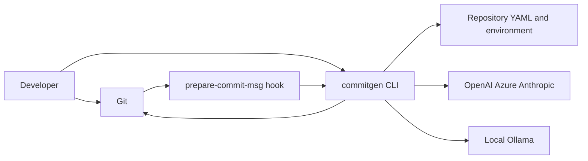
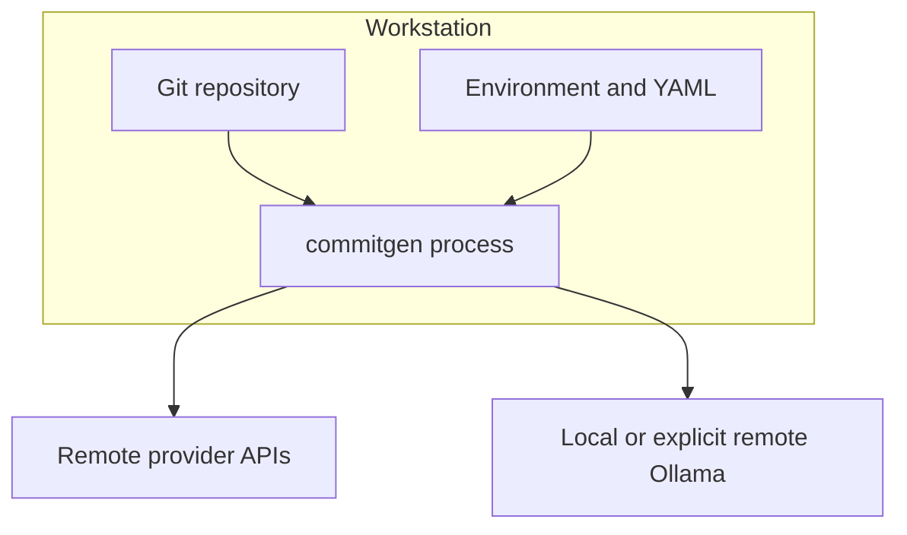
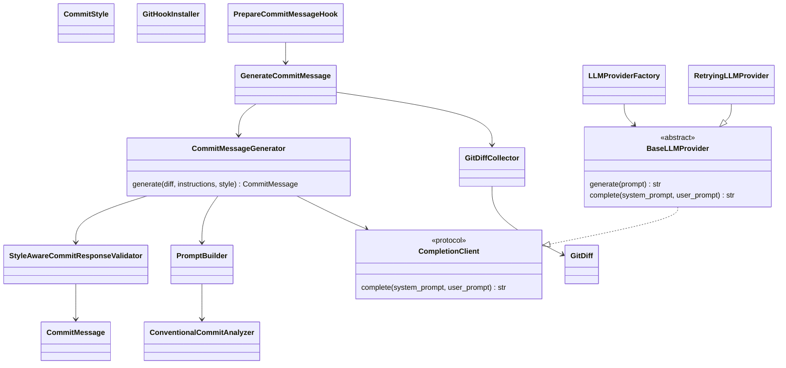
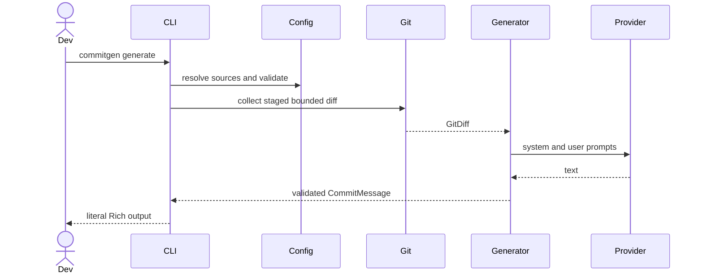
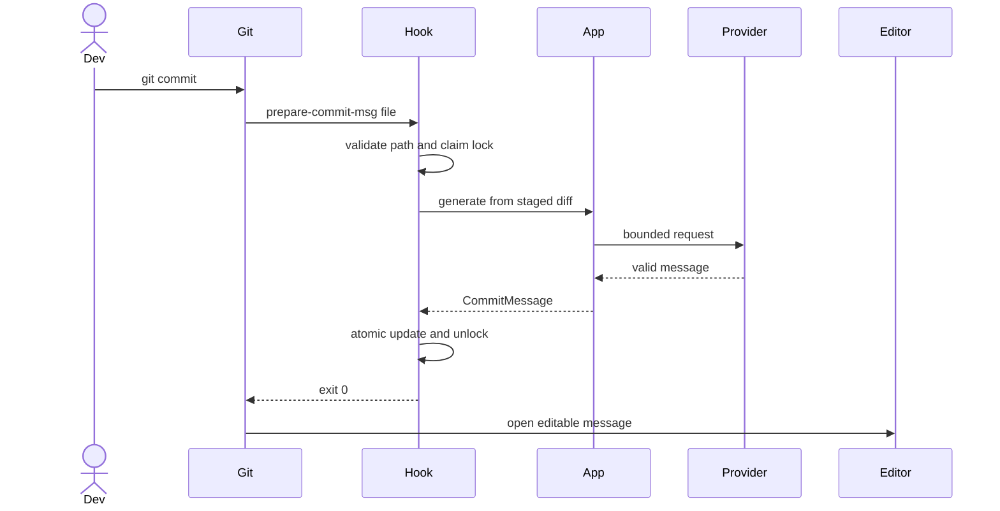
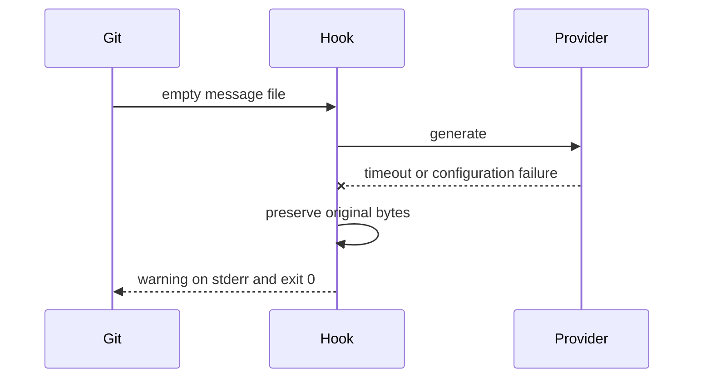
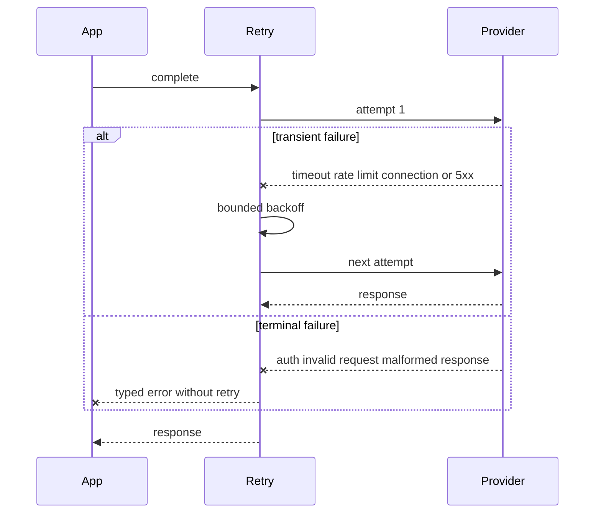
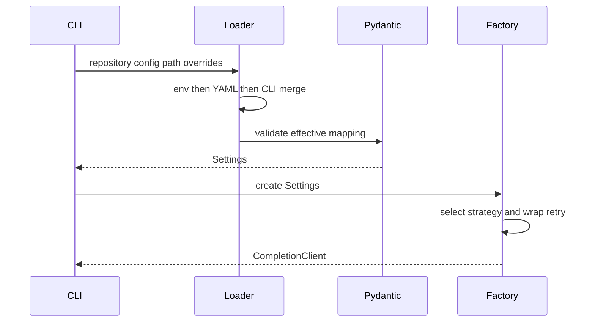

# Technical architecture

## Contents

- [Goals and constraints](#goals-and-constraints)
- [System context](#system-context)
- [Layers and modules](#layers-and-modules)
- [Data and configuration flows](#data-and-configuration-flows)
- [Key components](#key-components)
- [Runtime sequences](#runtime-sequences)
- [Design decisions](#design-decisions)
- [Scale evolution](#scale-evolution)
- [Operations and compatibility](#operations-and-compatibility)

Related: [configuration](configuration.md), [hooks](hooks.md),
[edge cases](edge-cases.md), and [testing](testing.md).

## Goals and constraints

The system improves local commit-message workflows while remaining deterministic
at Git/configuration boundaries and provider-neutral at the application boundary.
Quality attributes are privacy awareness, bounded resource use, typed failure,
cross-platform behavior, testability, and practical source compatibility.

Non-goals include committing automatically, hosting a central service, proving
LLM output correctness, eliminating prompt injection, and silently repairing
provider output. The CLI and hook run on the developer workstation. OpenAI,
Azure OpenAI, and Anthropic are remote; Ollama is local by default but can be
explicitly configured remotely.

Trust boundaries:

1. Repository paths, patch text, Git configuration, YAML, and hook arguments are
   untrusted local input.
2. Provider endpoints receive bounded source content and return untrusted text.
3. Credentials enter through environment/configuration APIs and must never enter
   prompts, errors, or logs.

## System context

## Layers and modules

The dependency rule points inward. Domain/application code imports no Typer,
vendor SDK, YAML parser, or HTTP implementation.

| Layer | Modules | Responsibility |
| --- | --- | --- |
| Domain/policy | `models.py`, `commit_analyzer.py`, `response_validator.py` | Immutable values, style/type policy, local classification, response invariants |
| Application | `application.py`, `commit_generator.py`, `ports.py`, `prompt_builder.py` | Use-case orchestration and provider-neutral contracts |
| Infrastructure | `git_command.py`, `git_repository.py`, `git_selection.py`, `git_numstat.py`, `git_diff.py`, `llm_client.py`, `provider_factory.py`, `config.py` | Git, SDK/HTTP, retry, factory, YAML/environment adapters |
| Interface adapters | `cli.py`, `git_hooks.py` | Typer presentation, composition root, hook installation/runtime |

## Data and configuration flows

Configuration resolves **CLI > repository YAML > environment > defaults**.
Pydantic validates enum discriminators, ranges, coherent limits, provider fields,
and credential-free URLs. Default discovery checks only the repository root.
`SecretStr` redacts credentials; CLI output shows presence only.

Generation flow:

1. Git root validation and unresolved-conflict detection.
2. Shell-free staged patch/stat capture with stdout/stderr limits.
3. Optional deterministic type feature extraction and scoring.
4. Independent patch/summary bounds and JSON prompt framing.
5. Provider request through a strategy selected by the registry factory.
6. Provider-neutral transient retry decorator.
7. Strict style-aware response validation.
8. CLI rendering or atomic hook message update.

Patch/stat truncation is explicit. Exact numstat analysis never accepts truncated
metadata. Processing is O(n) in bounded input size. Git output spills to
temporary files, trading bounded memory for bounded temporary disk use. Collector
work normally uses root, conflict, patch, and stat subprocesses; analyzer uses
root, conflict, and numstat subprocesses.

## Key components

### Providers

`BaseLLMProvider.generate(prompt)` is the required simple strategy interface.
Its `complete(system, user)` bridge preserves roles for the existing
`CompletionClient`. OpenAI/Azure use chat completions, Anthropic uses messages,
and Ollama uses `/api/chat`. Constructors accept injected clients/transports.

Vendor SDK retries are disabled. `RetryingLLMProvider` retries only normalized
timeout, connection, rate-limit, and server errors, respects numeric
`Retry-After`, caps delay, and injects sleep. Authentication, invalid request,
configuration/dependency, and malformed response errors are terminal.

Adding a provider requires a `BaseLLMProvider` adapter, typed configuration, a
registry entry, and offline contract tests; application/domain services remain
unchanged.

### Conventional commit analysis

`GitPatchFeatureExtractor` normalizes destination paths and reads added lines,
not removed/context prose. `ConventionalCommitAnalyzer` applies exclusive
docs/test/CI/build/formatting path precedence, then weighted fix/perf/refactor/
feature signals, deterministic tie order, and a conservative `chore` default.
It never calls a provider or logs content. Binary/truncated input remains valid
but lowers available evidence. The Conventional prompt labels its result as an
overridable heuristic.

### Git boundaries

`GitDiffCollector` rejects an empty selected diff because generation has no
input. `GitDiffAnalyzer` returns zero counts for an empty diff. Both reject
unresolved conflicts. Binary files retain type with zero text counts; renames use
destination paths. External diff/textconv and color are disabled.

### Hook boundaries

Installation is atomic/idempotent, refuses foreign hooks by default, backs up on
explicit force, and rejects ambiguous filesystem objects. Runtime validates that
the regular non-symlink message file is inside the effective Git directory,
claims a short-lived exclusive lock, preserves comments, and atomically replaces
the file. Provider/config failures fail open; structural/security failures fail
closed. See [hooks](hooks.md).

Logging is content-free and best-effort. Events contain provider-independent
types, attempts, sizes, style, and truncation metadata—not prompts, diffs,
responses, paths, credentials, or vendor response bodies.

## Runtime sequences

### Interactive generation

### Hook success and editor handoff

### Hook recoverable failure

### Retry behavior

### Configuration and factory

## Design decisions

| Decision | Alternatives | Rationale | Consequences |
| --- | --- | --- | --- |
| Clean Architecture and DI | Direct SDK/Git calls in CLI | Testable inward dependencies | More explicit wiring |
| Strategy/Factory/Adapter/Decorator | Provider conditionals in generator | Extension without domain changes | Registry/config entry per provider |
| Deterministic local classifier | LLM classification | Fast, private, reproducible hint | Conservative heuristic can be overridden |
| Pydantic Settings | Ad-hoc environment parsing | One typed configuration graph | New validation errors are stricter |
| Repository-only YAML | Parent traversal | Predictable trust boundary | Teams must place/configure file explicitly |
| Temp-file Git capture | In-memory subprocess capture | Bounded memory and stderr | Temporary disk I/O |
| No hidden retries | SDK defaults | Explicit latency/cost policy | Retry decorator must be configured |
| JSON prompt framing | Raw delimiters | Safer untrusted-data boundary | Does not eliminate prompt injection |
| Strict style validation | Trimming/repair | Fail closed on model contract | Some otherwise usable text is rejected |
| Hook recoverable fail-open | Block commits | Developer workflow availability | Message may remain empty |
| Hook structural fail-close | Ignore unsafe paths | Prevent arbitrary writes | Security errors block that commit |
| Refuse/backup hooks | Silent overwrite/concatenate | Preserve user scripts | No automatic chaining |
| Offline-first tests | Live API tests | Deterministic, credential-free CI | Provider API drift needs dependency updates |

Security controls reduce exposure; they are not guarantees. Remote providers
receive staged code, and adversarial repository text can still influence a model.

## Scale evolution

The local CLI needs no central horizontal scaling. Adoption pressure appears in
provider quotas, governance, distribution, compatibility, and support.

| Current design | Trigger or metric | Next architecture |
| --- | --- | --- |
| Bounded exponential retry | Sustained 429 rate or high tail latency | Jitter, organization gateway, quota dashboards |
| Per-repository YAML | Organization policy drift | Signed policy overlays and credential-manager integration |
| Character/token limits | Frequent truncation in monorepos | Capability discovery and token-aware budgeting |
| One generated candidate | User rejection/regen rate | Batched candidates and interactive selection |
| No cache | Repeated identical staged hashes | Opt-in local encrypted cache with privacy-safe keys |
| Synchronous UX | Provider latency harms workflow | Async/streaming adapter capability |
| Built-in registry | Third-party provider demand | Versioned plugin SDK and compatibility contract |
| Editable installs/source builds | Broad distribution | Signed wheels, SBOM, reproducible builds, PyPI automation |
| Content-free local logs | Support cannot diagnose opt-in failures | Explicit opt-in telemetry with privacy review |
| Functional CI matrix | OS-specific defect rate | Windows/macOS matrix, shell fixtures, chaos/fault tests |
| No published benchmarks | Performance regressions reported | Repeatable fixtures, latency/memory SLOs |

## Operations and compatibility

The [edge-case matrix](edge-cases.md) defines typed and hook fail-open behavior.
The test pyramid and local commands are in [testing](testing.md). CI has separate
`lint`, `test`, `build`, and `security_scan` jobs with ≥90% coverage, Bandit,
pip-audit, artifact smoke installation, Python 3.10–3.13 coverage, and
Windows/macOS hook coverage on Python 3.13.

Semantic versioning is expected. `OpenAICompatibleClient` remains a source-
compatible alias of `OpenAIProvider`. The style-aware validator keeps its legacy
name as an alias, but custom validators must accept the style parameter. Provider
dependencies and public ports require deprecation notes before future removal.
Official GitHub Actions major tags are currently used because automated trusted
digest updates are not configured; pinning verified digests is future hardening.
